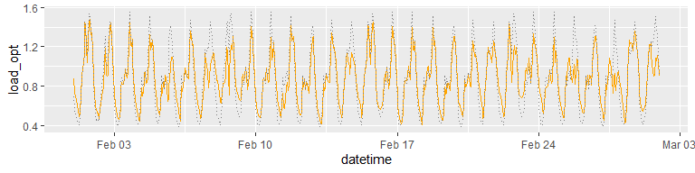

<!-- README.md is generated from README.Rmd. Please edit that file -->

# depmicrosimr

<!-- badges: start -->

<!-- badges: end -->

Dynamic electricity pricing (DEP) is thought to be a useful tool to
increase flexibility in power systems. Flexibility means a near a
real-time system balancing effect that reduces renewables curtailment,
enhances peak-shaving, reduces the need for storage etc. DEP is a
win-win that can produce financial gains at both system and the
individual household level. *depmicrosimr* is an agent-based model
designed to (1) project the uptake of dynamic electricity tariffs on
Irish consumers and (2) investigate the consequences for the power
system.

## Installation

You can install the development version of *depmicrosimr* using:

``` r
remotes::install_github("phalacrocorax-gaimardi/depmicrosimr")
```

## Examples

*depmicrosimr* simulates load-shifting arising from a switch from flat
to dynamic pricing using a penalised quadratic model and the OSQP
solver. The key parameters are a behavioural cost penalty factor
$`\gamma`$, a load-shift timescale $`\tau`$, and an inflexible load
fraction $`\phi`$. A household can tolerate departures from the
“natural” household load profile (taken to be their flat tariff profile)
over periods shorter than $`\tau`$ with little penalty, but the penalty
grows steeply over periods longer than $`\tau`$.

Wholesale prices are contained in *sem_prices_2023_2025*. The example
below assumes the standard urban load profile LP1 from the dataset
*load_profiles*.

``` r
library(depmicrosimr)
#optimise load-shifting behaviour based on 2025 wholesale prices for a household with "natural" load profile LP1
demand <- make_demand_response_data(profile="lp1",mean_daily_load=20,years=2025)
#assume 50% of load is flexible, behavioural cost parameter is 0.5, loads are shiftable over 24h period.
demand_response <- get_flex(demand,phi=0.5,tau=24,gamma=0.5)
#add a day of year column
demand_response <- demand_response %>% dplyr::mutate(yday=lubridate::yday(datetime))
#plot the unshifted and shifted loads for February
library(ggplot2)
dr <- demand_response %>% dplyr::filter(yday %in% 32:60) 
dr %>% ggplot()+geom_line(aes(datetime,load_opt),colour="orange")+geom_line(aes(datetime,load),colour="grey50",linetype="dotted")
```


